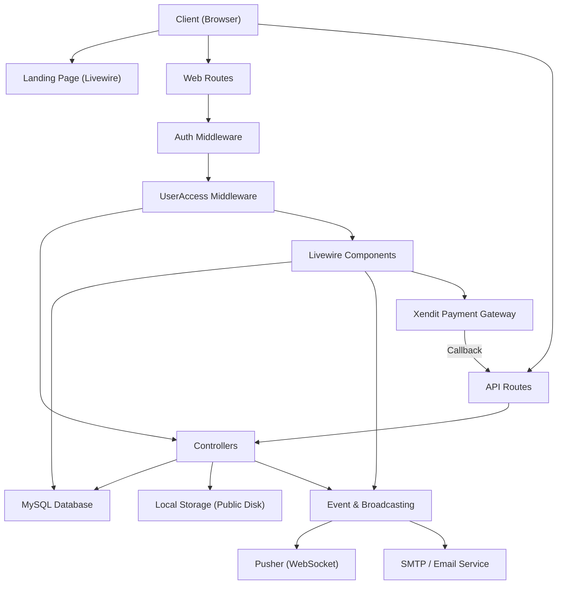
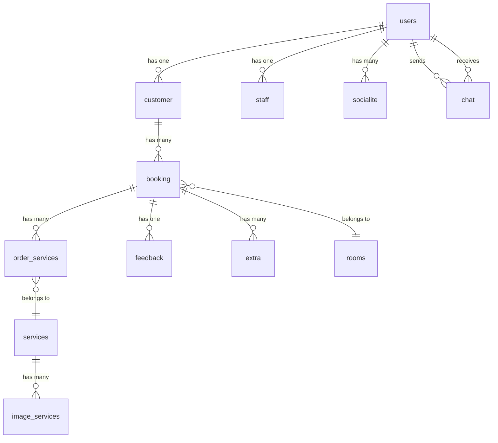
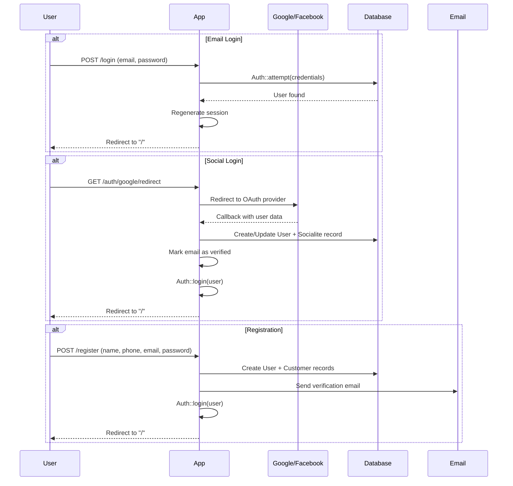
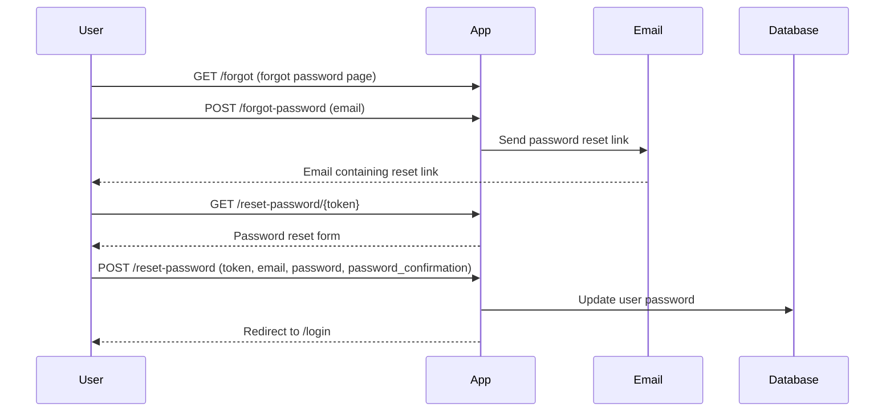
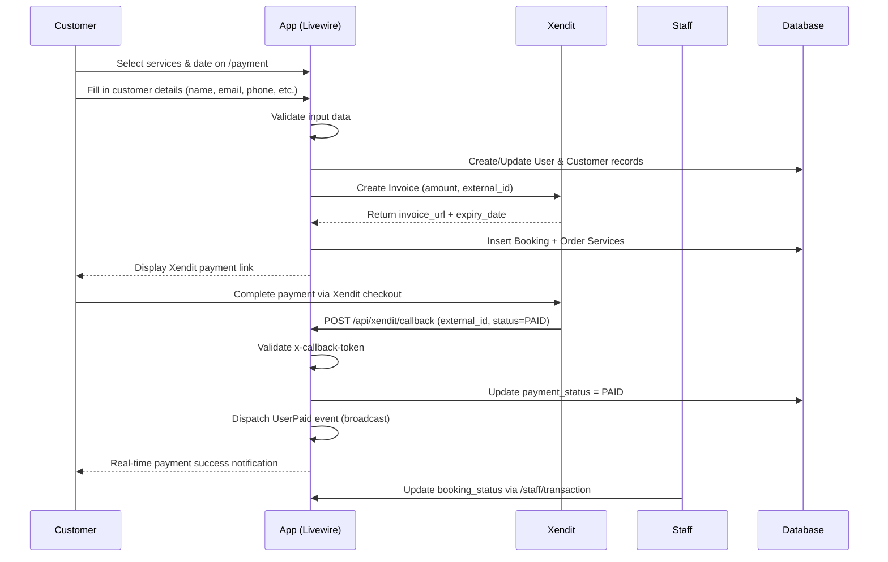
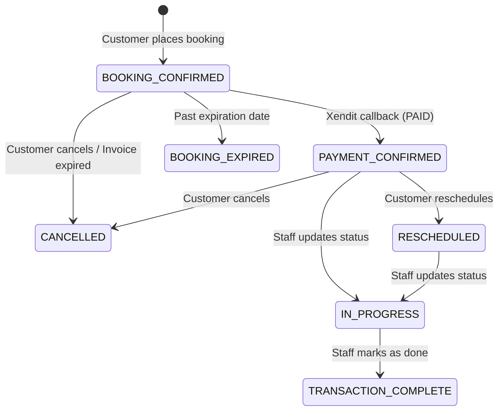
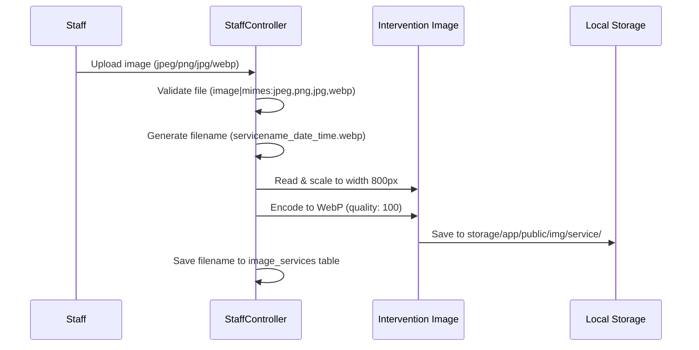

# The Cajuput Spa — Booking & Management System

## Description

**The Cajuput Spa** is a comprehensive web-based spa booking and management system built with the Laravel framework. The application is designed to manage end-to-end spa operations, including a public-facing landing page, customer service booking, online payment processing via Xendit Payment Gateway, staff transaction management, and administrative account management with reporting capabilities. The system also supports real-time chat between customers and staff, social login (Google & Facebook), email verification, and Excel report exports.

---

## System Overview

| Item              | Details                                                |
| ----------------- | ------------------------------------------------------ |
| Framework         | Laravel 11.x                                           |
| PHP               | ^8.2                                                   |
| Database          | MySQL                                                  |
| Authentication    | Laravel Sanctum + Socialite (Google, Facebook)          |
| Queue             | Sync (default)                                         |
| Cache             | File                                                   |
| Storage           | Local (public disk)                                    |
| Broadcast         | Pusher                                                 |
| Payment Gateway   | Xendit                                                 |
| Frontend Reactive | Livewire 3.x                                           |
| Export            | Maatwebsite Excel 3.x                                  |
| Image Processing  | Intervention Image 3.x (GD Driver, WebP Encoding)     |

---

## Key Features

* **Public Landing Page** — Displays available services, rooms, testimonials/feedback, and contact information.
* **Multi-Provider Authentication** — Login/Register via email+password, Google OAuth, and Facebook OAuth.
* **Email Verification** — Mandatory email verification before accessing core features.
* **Forgot & Reset Password** — Password recovery flow via email link.
* **Online Booking & Payment** — Spa service booking with automated payment via Xendit Invoice API.
* **Real-time Chat** — Customer-staff communication through Pusher broadcasting and Livewire.
* **Service Management** — Full CRUD for spa services with image upload (automatic WebP conversion).
* **Room Management** — Full CRUD for spa rooms with capacity and category attributes.
* **Account Management** — Admin can manage admin, staff, and customer accounts including role changes.
* **Transaction & Booking Status** — Staff can monitor and update booking status (BOOKING CONFIRMED → PAYMENT CONFIRMED → IN PROGRESS → TRANSACTION COMPLETE / CANCELLED).
* **Reschedule & Cancellation** — Customers can reschedule or cancel their bookings.
* **Feedback & Rating** — Customers can submit reviews and ratings (1–5 stars) per booking.
* **Reporting & Export** — Monthly sales reports per year and service transaction reports, exportable to Excel (.xlsx).
* **Cash Flow Dashboard** — Admin can view cash flow based on service transactions.
* **Role-Based Access Control** — Three user levels: `admin`, `staff`, `customer`.

---

## Backend Architecture



---

## Folder Structure

```text
app/
├── Console/
│   └── Kernel.php                  # Scheduler (no scheduled tasks defined)
├── Events/
│   ├── PaymentStatusUpdated.php    # Payment status update event
│   ├── ReceiveChat.php             # Real-time chat event (ShouldBroadcast)
│   ├── UserPaid.php                # User payment completed event (ShouldBroadcast)
│   └── UserVerified.php            # User email verified event (ShouldBroadcast)
├── Exceptions/
│   └── Handler.php                 # Global exception handler
├── Exports/
│   ├── TransactionExport.php       # Service transaction Excel export
│   └── YearlySalesExport.php       # Yearly sales Excel export
├── Http/
│   ├── Controllers/
│   │   ├── AdminController.php     # CRUD admin/staff/customer accounts, reporting, cash flow
│   │   ├── Authentication.php      # Login, register, logout
│   │   ├── Controller.php          # Base controller
│   │   ├── CustomerController.php  # Customer dashboard, transactions, feedback
│   │   ├── LandingController.php   # Landing page, service/room details
│   │   ├── SocialiteController.php # Google & Facebook OAuth
│   │   ├── StaffController.php     # Staff dashboard, CRUD services/rooms, transactions, reports
│   │   ├── VerificationController.php  # Email verification
│   │   └── xendit.php              # Xendit callback & expire invoice
│   ├── Kernel.php                  # Global middleware stack and route groups
│   └── Middleware/
│       ├── Authenticate.php
│       ├── EncryptCookies.php
│       ├── PreventRequestsDuringMaintenance.php
│       ├── RedirectIfAuthenticated.php
│       ├── TrimStrings.php
│       ├── TrustHosts.php
│       ├── TrustProxies.php
│       ├── UserAcess.php           # Custom role-based access middleware
│       ├── ValidateSignature.php
│       └── VerifyCsrfToken.php
├── Listeners/
│   └── UpdateBookingStatus.php     # Listener: updates booking when payment status changes
├── Livewire/
│   ├── Auth/
│   │   ├── Forgot.php              # Forgot password form
│   │   ├── Login.php               # Login form
│   │   ├── Register.php            # Registration form
│   │   └── Ssobutton.php           # SSO buttons (Google/Facebook)
│   ├── ChatStaff.php               # Real-time chat (staff side)
│   ├── Customer/
│   │   ├── Profile.php             # Customer profile
│   │   └── Transaction.php         # Transaction list, feedback, reschedule, cancellation
│   ├── Detail/
│   │   ├── Room.php                # Room detail page
│   │   └── Service.php             # Service detail page
│   ├── Landing/
│   │   ├── Chat.php                # Chat widget (customer side)
│   │   ├── Contact.php             # Contact section
│   │   ├── Feedback.php            # Feedback section
│   │   ├── Footer.php              # Footer
│   │   ├── Hero.php                # Hero section
│   │   ├── Index.php               # Main landing page
│   │   ├── Logo.php                # Logo
│   │   ├── Navbar.php              # Navbar
│   │   ├── Recommendation.php      # Service recommendations
│   │   ├── Rooms.php               # Room listing
│   │   ├── Services.php            # Service listing with ratings
│   │   ├── Testimonial.php         # Testimonials
│   │   └── Welcome.php             # Welcome section
│   └── PaymentUser/
│       ├── Date.php                # Booking date input
│       ├── DateInput.php           # Date input component
│       ├── FormCustomer.php        # Customer data form
│       ├── Index.php               # Main payment page (Xendit integration)
│       ├── Invoice.php             # Invoice and service summary
│       ├── Navbar.php              # Payment navbar
│       ├── NextPayment.php         # Proceed to payment button
│       ├── Payment.php             # Payment component
│       ├── SelectService.php       # Service selection
│       ├── UnfinishedPayment.php   # Unfinished payment handler
│       └── VerifyEmail.php         # Email verification during payment
├── Models/
│   ├── Booking.php
│   ├── Chat.php
│   ├── Customer.php
│   ├── Feedback.php
│   ├── Image_service.php
│   ├── OrderPackage.php
│   ├── OrderService.php
│   ├── Package.php
│   ├── Room.php
│   ├── Service.php
│   ├── Services.php                # Empty model (legacy)
│   ├── Socialite.php
│   ├── Staff.php
│   └── User.php
└── Providers/
    ├── AppServiceProvider.php
    ├── AuthServiceProvider.php
    ├── BroadcastServiceProvider.php
    ├── EventServiceProvider.php
    └── RouteServiceProvider.php
```

---

## Installation

### Clone Repository

```bash
git clone <repository-url>
cd simparisApp
```

### Install PHP Dependencies

```bash
composer install
```

### Install Node.js Dependencies

```bash
npm install
```

### Environment Configuration

```bash
cp .env.example .env
```

### Generate Application Key

```bash
php artisan key:generate
```

### Database Configuration

Edit the `.env` file and update the database connection settings:

```env
DB_CONNECTION=mysql
DB_HOST=127.0.0.1
DB_PORT=3306
DB_DATABASE=simparisapp
DB_USERNAME=root
DB_PASSWORD=
```

### Run Migrations

```bash
php artisan migrate
```

### Seed Database

```bash
php artisan db:seed
```

> **Default Seeder Credentials:**
>
> | Email              | Password   | Role     |
> | ------------------ | ---------- | -------- |
> | admin@cajuput.com  | 12345678   | admin    |
> | staff@cajuput.com  | 12345678   | staff    |
> | ariana@gmail.com   | 12345678   | customer |
> | diva@gmail.com     | 12345678   | customer |
> | fauzi@gmail.com    | 12345678   | customer |
> | richard@gmail.com  | 12345678   | customer |
> | bella@gmail.com    | 12345678   | customer |
> | gigi@gmail.com     | 12345678   | customer |

### Create Storage Symlink

```bash
php artisan storage:link
```

### Build Frontend Assets

```bash
npm run build
```

### Start Development Server

```bash
php artisan serve
```

The application will be accessible at `http://localhost:8000`

---

## Environment Variables

| Variable                 | Description                                        |
| ------------------------ | -------------------------------------------------- |
| `APP_NAME`               | Application name                                   |
| `APP_ENV`                | Environment (local/production)                     |
| `APP_KEY`                | Application encryption key                         |
| `APP_DEBUG`              | Debug mode (true/false)                            |
| `APP_URL`                | Base application URL                               |
| `DB_CONNECTION`          | Database driver (mysql)                            |
| `DB_HOST`                | Database host                                      |
| `DB_PORT`                | Database port (3306)                               |
| `DB_DATABASE`            | Database name                                      |
| `DB_USERNAME`            | Database username                                  |
| `DB_PASSWORD`            | Database password                                  |
| `LOG_CHANNEL`            | Logging channel (stack)                            |
| `LOG_DEPRECATIONS_CHANNEL` | Deprecation log channel                          |
| `LOG_LEVEL`              | Log level (debug)                                  |
| `BROADCAST_DRIVER`       | Broadcast driver (log/pusher)                      |
| `CACHE_DRIVER`           | Cache driver (file)                                |
| `FILESYSTEM_DISK`        | Filesystem disk (local)                            |
| `QUEUE_CONNECTION`       | Queue driver (sync)                                |
| `SESSION_DRIVER`         | Session driver (file)                              |
| `SESSION_LIFETIME`       | Session lifetime in minutes (120)                  |
| `MEMCACHED_HOST`         | Memcached host                                     |
| `REDIS_HOST`             | Redis host                                         |
| `REDIS_PASSWORD`         | Redis password                                     |
| `REDIS_PORT`             | Redis port (6379)                                  |
| `MAIL_MAILER`            | Mail driver (smtp)                                 |
| `MAIL_HOST`              | SMTP host                                          |
| `MAIL_PORT`              | SMTP port                                          |
| `MAIL_USERNAME`          | SMTP username                                      |
| `MAIL_PASSWORD`          | SMTP password                                      |
| `MAIL_ENCRYPTION`        | SMTP encryption (null/tls/ssl)                     |
| `MAIL_FROM_ADDRESS`      | Default sender email                               |
| `MAIL_FROM_NAME`         | Default sender name                                |
| `AWS_ACCESS_KEY_ID`      | AWS Access Key (for SES if applicable)             |
| `AWS_SECRET_ACCESS_KEY`  | AWS Secret Key                                     |
| `AWS_DEFAULT_REGION`     | AWS Region                                         |
| `AWS_BUCKET`             | AWS S3 Bucket                                      |
| `PUSHER_APP_ID`          | Pusher App ID for real-time broadcasting           |
| `PUSHER_APP_KEY`         | Pusher App Key                                     |
| `PUSHER_APP_SECRET`      | Pusher App Secret                                  |
| `PUSHER_HOST`            | Pusher Host (optional)                             |
| `PUSHER_PORT`            | Pusher Port (443)                                  |
| `PUSHER_SCHEME`          | Pusher Scheme (https)                              |
| `PUSHER_APP_CLUSTER`     | Pusher Cluster (mt1)                               |
| `XENDIT_API_KEY`         | Xendit API Key for payment processing              |
| `XENDIT_CALLBACK_TOKEN`  | Xendit callback token for webhook verification     |
| `XENDIT_BUSSINES_ID`     | Xendit Business ID                                 |
| `FACEBOOK_CLIENT_ID`     | Facebook OAuth Client ID                           |
| `FACEBOOK_CLIENT_SECRET` | Facebook OAuth Client Secret                       |
| `FACEBOOK_REDIRECT_URL`  | Facebook OAuth Callback URL                        |
| `GOOGLE_CLIENT_ID`       | Google OAuth Client ID                             |
| `GOOGLE_CLIENT_SECRET`   | Google OAuth Client Secret                         |
| `GOOGLE_REDIRECT_URL`    | Google OAuth Callback URL                          |

---

## Database Schema

### Table: `users`

| Column               | Type                              | Description                           |
| -------------------- | --------------------------------- | ------------------------------------- |
| `id`                | bigint unsigned (PK, AI)          | Primary key                           |
| `name`              | varchar(255)                      | User's full name                      |
| `email`             | varchar(255), UNIQUE              | Email address (unique)                |
| `email_verified_at` | timestamp, NULLABLE               | Email verification timestamp          |
| `password`          | varchar(255), NULLABLE            | Password (bcrypt hashed)              |
| `level`             | enum('admin','staff','customer')  | User role/access level                |
| `remember_token`    | varchar(100)                      | "Remember me" token                   |
| `created_at`        | timestamp                         | Record creation timestamp             |
| `updated_at`        | timestamp                         | Record last update timestamp          |

---

### Table: `customer`

| Column      | Type                     | Description                   |
| ---------- | ------------------------ | ----------------------------- |
| `id`       | bigint unsigned (PK, AI) | Primary key                   |
| `phone`    | varchar(15), NULLABLE    | Phone number                  |
| `address`  | varchar(50), NULLABLE    | Street address                |
| `country`  | varchar(50), NULLABLE    | Country                       |
| `id_users` | bigint unsigned (FK)     | Foreign key → `users.id`      |
| `created_at` | timestamp              | Record creation timestamp     |
| `updated_at` | timestamp              | Record last update timestamp  |

---

### Table: `staff`

| Column      | Type                     | Description                   |
| ---------- | ------------------------ | ----------------------------- |
| `id`       | bigint unsigned (PK, AI) | Primary key                   |
| `phone`    | varchar(50), NULLABLE    | Phone number                  |
| `id_users` | bigint unsigned (FK)     | Foreign key → `users.id`      |
| `created_at` | timestamp              | Record creation timestamp     |
| `updated_at` | timestamp              | Record last update timestamp  |

---

### Table: `services`

| Column              | Type                     | Description                          |
| ------------------- | ------------------------ | ------------------------------------ |
| `id`               | bigint unsigned (PK, AI) | Primary key                          |
| `service_name`     | varchar(50)              | Service name                         |
| `type`             | varchar(20)              | Type (SERVICE / TREATMENT / PACKAGE) |
| `service_duration` | tinyint                  | Duration in minutes                  |
| `details`          | text                     | Service description                  |
| `price`            | integer                  | Price in IDR                         |
| `created_at`       | timestamp                | Record creation timestamp            |
| `updated_at`       | timestamp                | Record last update timestamp         |

---

### Table: `image_services`

| Column        | Type                     | Description                      |
| ------------ | ------------------------ | -------------------------------- |
| `id`         | bigint unsigned (PK, AI) | Primary key                      |
| `imgdir`     | varchar(255)             | Image filename (WebP format)     |
| `service_id` | bigint unsigned (FK)     | Foreign key → `services.id`      |
| `created_at` | timestamp                | Record creation timestamp        |
| `updated_at` | timestamp                | Record last update timestamp     |

---

### Table: `rooms`

| Column         | Type                     | Description             |
| ------------- | ------------------------ | ----------------------- |
| `id`          | bigint unsigned (PK, AI) | Primary key             |
| `room_name`   | varchar(50)              | Room name               |
| `category`    | varchar(50)              | Room category           |
| `capacity`    | integer (default: 1)     | Maximum occupancy       |
| `description` | text                     | Room description        |
| `created_at`  | timestamp                | Record creation timestamp |
| `updated_at`  | timestamp                | Record last update timestamp |

---

### Table: `booking`

| Column            | Type                     | Description                                    |
| ---------------- | ------------------------ | ---------------------------------------------- |
| `id`             | bigint unsigned (PK, AI) | Primary key                                    |
| `total`          | integer                  | Total booking amount (price × pax)             |
| `pax`            | tinyint                  | Number of guests                               |
| `date`           | timestamp                | Booking date and time                          |
| `expired_date`   | datetime, NULLABLE       | Payment expiration date                        |
| `external_id`    | varchar(255)             | Xendit external ID (format: ENV-YYYYMMDD-uid)  |
| `payment_url`    | varchar(255)             | Xendit payment checkout URL                    |
| `booking_status` | varchar(255)             | Booking status (see status table below)        |
| `payment_status` | varchar(255)             | Payment status from Xendit (PENDING/PAID)      |
| `id_customer`    | bigint unsigned (FK)     | Foreign key → `customer.id`                    |
| `id_room`        | bigint unsigned (FK)     | Foreign key → `rooms.id`                       |
| `created_at`     | timestamp                | Record creation timestamp                      |
| `updated_at`     | timestamp                | Record last update timestamp                   |

**Booking Status Values:**

| Status                 | Description                                  |
| ---------------------- | -------------------------------------------- |
| `BOOKING CONFIRMED`    | Booking created, awaiting payment            |
| `PAYMENT CONFIRMED`    | Payment verified successfully                |
| `RESCHEDULED`          | Schedule changed by customer                 |
| `IN PROGRESS`          | Service currently in progress                |
| `TRANSACTION COMPLETE` | Transaction completed                        |
| `CANCELLED`            | Booking cancelled                            |
| `BOOKING EXPIRED`      | Booking expired past deadline                |

---

### Table: `order_services`

| Column        | Type                     | Description                   |
| ------------ | ------------------------ | ----------------------------- |
| `id`         | bigint unsigned (PK, AI) | Primary key                   |
| `id_booking` | bigint unsigned (FK)     | Foreign key → `booking.id`    |
| `id_services`| bigint unsigned (FK)     | Foreign key → `services.id`   |
| `created_at` | timestamp                | Record creation timestamp     |
| `updated_at` | timestamp                | Record last update timestamp  |

---

### Table: `feedback`

| Column        | Type                     | Description                   |
| ------------ | ------------------------ | ----------------------------- |
| `id`         | bigint unsigned (PK, AI) | Primary key                   |
| `rate`       | integer                  | Rating score (1–5)            |
| `title`      | varchar(255), NULLABLE   | Review title                  |
| `message`    | text, NULLABLE           | Review content                |
| `id_booking` | bigint unsigned (FK)     | Foreign key → `booking.id`    |
| `created_at` | timestamp                | Record creation timestamp     |
| `updated_at` | timestamp                | Record last update timestamp  |

---

### Table: `chat`

| Column         | Type                     | Description                            |
| ------------- | ------------------------ | -------------------------------------- |
| `id`          | bigint unsigned (PK, AI) | Primary key                            |
| `message`     | varchar(255)             | Message content                        |
| `sender_id`   | bigint unsigned (FK)     | Foreign key → `users.id` (sender)      |
| `receiver_id` | bigint unsigned (FK)     | Foreign key → `users.id` (recipient)   |
| `is_read`     | boolean (default: false) | Read status                            |
| `created_at`  | timestamp                | Record creation timestamp              |
| `updated_at`  | timestamp                | Record last update timestamp           |

---

### Table: `socialite`

| Column                  | Type                     | Description                       |
| ---------------------- | ------------------------ | --------------------------------- |
| `id`                   | bigint unsigned (PK, AI) | Primary key                       |
| `user_id`              | bigint                   | User ID                           |
| `provider_id`          | varchar(255)             | OAuth provider ID                 |
| `provider_name`        | varchar(255)             | Provider name (google/facebook)   |
| `provider_token`       | longText                 | OAuth access token                |
| `provider_refresh_token` | varchar(255), NULLABLE | OAuth refresh token               |
| `created_at`           | timestamp                | Record creation timestamp         |
| `updated_at`           | timestamp                | Record last update timestamp      |

---

### Table: `extra`

| Column         | Type                     | Description                   |
| ------------- | ------------------------ | ----------------------------- |
| `id`          | bigint unsigned (PK, AI) | Primary key                   |
| `type`        | enum('income','outcome') | Extra charge type              |
| `amount`      | integer                  | Amount                         |
| `description` | varchar(255)             | Description                    |
| `id_booking`  | bigint unsigned (FK)     | Foreign key → `booking.id`    |
| `created_at`  | timestamp                | Record creation timestamp     |
| `updated_at`  | timestamp                | Record last update timestamp  |

---

### Additional Tables (Laravel Defaults)

| Table                    | Description                       |
| ------------------------ | --------------------------------- |
| `password_reset_tokens`  | Password reset tokens             |
| `failed_jobs`            | Failed queue jobs                 |
| `personal_access_tokens` | Sanctum API tokens                |

---

### Entity Relationship Diagram



---

## Models

### User

* **Table:** `users`
* **Fillable:** `name`, `email`, `password`, `level`
* **Hidden:** `password`, `remember_token`
* **Casts:** `email_verified_at` → `datetime`, `password` → `hashed`
* **Traits:** `HasApiTokens`, `HasFactory`, `Notifiable`, `CanResetPassword`
* **Implements:** `MustVerifyEmail`
* **Relationships:**
  - `socialite()` → HasMany(`Socialite`)

### Booking

* **Table:** `booking`
* **Fillable:** `status_booking`, `pax`, `date`, `id_customer`, `id_staff`, `id_transaction`, `created_at`, `updated_at`

### Customer

* **Table:** `customer`
* **Fillable:** `phone`, `id_users`, `address`, `country`

### Staff

* **Table:** `staff`
* **Fillable:** `image`, `phone`, `id_users`

### Service

* **Table:** `services` (default)
* **Fillable:** `service_name`, `details`, `price`, `packace_name`

### Room

* **Table:** `rooms`
* **Fillable:** `room_name`, `category`, `capacity`, `description`, `created_at`, `updated_at`

### Chat

* **Table:** `chat`
* **Fillable:** `message`, `sender_id`, `receiver_id`, `is_read`
* **Boot Event:** On `created` → dispatches `ReceiveChat` broadcast event

### Feedback

* **Table:** `feedback`
* **Fillable:** `rate`, `title`, `message`, `id_booking`, `created_at`, `updated_at`

### Image_service

* **Table:** `image_services` (default)
* **Fillable:** `imgdir`, `service_id`

### OrderService

* **Table:** `order_services`
* **Fillable:** `id_booking`, `id_services`, `id_room`

### OrderPackage

* **Table:** `order_package`
* **Fillable:** `id_booking`, `id_package`, `id_room`

### Package

* **Table:** `package`
* **Fillable:** `package_name`, `package_duration`, `price`, `detail`, `created_at`, `updated_at`
* **Note:** This table has been dropped in a later migration. Package functionality has been consolidated into the `services` table via the `type` column.

### Socialite

* **Table:** `socialite`
* **Fillable:** `user_id`, `provider_id`, `provider_name`, `provider_token`, `provider_refresh_token`
* **Relationships:**
  - `user()` → BelongsTo(`User`)

---

## API Documentation

### API Routes

All API routes are defined in `routes/api.php` with the `/api` prefix.

---

### Get Authenticated User

```http
GET /api/user
```

**Middleware:** `auth:sanctum`

**Response:**

```json
{
  "id": 1,
  "name": "admin",
  "email": "admin@cajuput.com",
  "level": "admin"
}
```

---

### Xendit Payment Callback

```http
POST /api/xendit/callback
```

**Middleware:** None (public endpoint for Xendit webhook)

**Headers:**

| Header              | Value                                    |
| ------------------- | ---------------------------------------- |
| `x-callback-token`  | Must match `XENDIT_CALLBACK_TOKEN` env   |

**Request Body (from Xendit):**

```json
{
  "external_id": "ENV-20240705-6687659d631dd",
  "status": "PAID"
}
```

**Success Response:**

```json
{
  "status": "success",
  "message": "payment status updated"
}
```

**Error Response (invalid token):**

```json
{
  "status": "error",
  "message": "invalid callback token"
}
```

**Logic:**
1. Validates the `x-callback-token` header against the environment variable.
2. Updates `payment_status` in the `booking` table based on `external_id`.
3. Dispatches the `UserPaid` event for real-time notification.

---

### Expire Xendit Invoice

```http
GET /api/xendit/expire/{invoice_id}
```

**Parameters:**

| Parameter    | Type   | Description              |
| ------------ | ------ | ------------------------ |
| `invoice_id` | string | Xendit invoice ID        |

**Success Response:**

```json
"success"
```

**Error Response:**

```json
{
  "status": "error",
  "message": "Failed to expire invoice",
  "error": "..."
}
```

---

## Web Routes

### Public Routes

| Method | URI                            | Handler                       | Description                  |
| ------ | ------------------------------ | ----------------------------- | ---------------------------- |
| GET    | `/`                            | `Livewire\Landing\Index`      | Landing page                 |
| GET    | `/service/{id}`                | `Livewire\Detail\Service`     | Service detail               |
| GET    | `/room/{id}`                   | `Livewire\Detail\Room`        | Room detail                  |
| GET    | `/payment`                     | `Livewire\PaymentUser\Index`  | Booking & payment page       |

### Socialite OAuth

| Method | URI                            | Handler                          | Description                  |
| ------ | ------------------------------ | -------------------------------- | ---------------------------- |
| GET    | `/auth/{provider}/redirect`    | `SocialiteController@redirect`   | Redirect to OAuth provider   |
| GET    | `/auth/{provider}/callback`    | `SocialiteController@callback`   | Callback from OAuth provider |

### Authentication (Guest Only)

| Method | URI                            | Handler                       | Description                  |
| ------ | ------------------------------ | ----------------------------- | ---------------------------- |
| GET    | `/login`                       | `Livewire\Auth\Login`         | Login page                   |
| GET    | `/register`                    | `Livewire\Auth\Register`      | Registration page            |
| GET    | `/forgot`                      | `Livewire\Auth\Forgot`        | Forgot password page         |
| POST   | `/forgot-password`             | Closure                       | Send password reset link     |
| GET    | `/reset-password/{token}`      | Closure                       | Reset password form          |
| POST   | `/reset-password`              | Closure                       | Process password reset       |

### Email Verification (Auth Required)

| Method | URI                                  | Middleware               | Description                        |
| ------ | ------------------------------------ | ------------------------ | ---------------------------------- |
| GET    | `/email/verify/{id}/{hash}`          | `auth`, `signed`         | Verify email address               |
| GET    | `/email/verify`                      | `auth`                   | Verification notice                |
| POST   | `/email/verification-notification`   | `auth`, `throttle:6,1`   | Resend verification link           |
| GET    | `/logout`                            | `auth`                   | Logout                             |

### Customer Routes (Auth + Verified + Role: customer)

| Method | URI                            | Handler                          | Description                  |
| ------ | ------------------------------ | -------------------------------- | ---------------------------- |
| GET    | `/transaction`                 | `Livewire\Customer\Transaction`  | Transaction history          |
| GET    | `/profile`                     | `Livewire\Customer\Profile`      | Customer profile             |
| GET    | `/feedback`                    | `Transaction@feedback`           | Submit feedback              |
| GET    | `/cancel/{id}`                 | `Transaction@cancel`             | Cancel booking               |

### Staff Routes (Auth + Verified + Role: staff)

| Method   | URI                              | Handler                             | Description                     |
| -------- | -------------------------------- | ----------------------------------- | ------------------------------- |
| GET      | `/staff`                         | `StaffController@dashboard`         | Staff dashboard                 |
| GET      | `/staff/transaction`             | `StaffController@getTransaction`    | Transaction list                |
| GET      | `/staff/chat`                    | `StaffController@chat`              | Chat page                       |
| PUT      | `/staff/updatetransaction/{id}`  | `StaffController@updateTransaction` | Update transaction status       |
| POST     | `/staff/donetransaction/{id}`    | `StaffController@doneTransaction`   | Mark transaction complete       |
| GET      | `/staff/room`                    | `StaffController@getRoom`           | Room list                       |
| POST     | `/staff/addroom`                 | `StaffController@addRoom`           | Add new room                    |
| PUT      | `/staff/updateroom/{id}`         | `StaffController@updateRoom`        | Update room                     |
| DELETE   | `/staff/deleteroom/{id}`         | `StaffController@deleteRoom`        | Delete room                     |
| GET/POST | `/staff/service`                 | `StaffController@getService`        | Service list (with search)      |
| POST     | `/staff/addservice`              | `StaffController@addService`        | Add new service                 |
| PUT      | `/staff/updateservice/{id}`      | `StaffController@updateService`     | Update service                  |
| DELETE   | `/staff/deleteservice/{id}`      | `StaffController@deleteService`     | Delete service                  |
| GET      | `/staff/report`                  | `StaffController@getReport`         | Sales report                    |
| GET      | `/staff/export`                  | `StaffController@exportReport`      | Export report to Excel          |

### Admin Routes (Auth + Verified + Role: admin)

| Method | URI                            | Handler                                    | Description                   |
| ------ | ------------------------------ | ------------------------------------------ | ----------------------------- |
| GET    | `/admin`                       | `AdminController@index`                    | Redirect to admin-account     |
| GET    | `/admin-dashboard`             | `AdminController@index`                    | Admin dashboard               |
| GET    | `/admin-account`               | `AdminController@getAdmin`                 | Admin account list            |
| POST   | `/add-admin`                   | `AdminController@addAdmin`                 | Add admin account             |
| PUT    | `/update-admin/{id}`           | `AdminController@updateAdmin`              | Update admin (incl. role change) |
| DELETE | `/delete-admin/{id}`           | `AdminController@deleteAdmin`              | Delete admin account          |
| GET    | `/staff-account`               | `AdminController@getStaff`                 | Staff account list            |
| POST   | `/add-staff`                   | `AdminController@addStaff`                 | Add staff account             |
| PUT    | `/update-staff/{id}`           | `AdminController@updateStaff`              | Update staff (incl. role change) |
| DELETE | `/delete-staff/{id}`           | `AdminController@deleteStaff`              | Delete staff account          |
| GET    | `/customer-account`            | `AdminController@getCustomer`              | Customer account list         |
| POST   | `/add-customer`                | `AdminController@addCustomer`              | Add customer account          |
| PUT    | `/update-customer/{id}`        | `AdminController@updateCustomer`           | Update customer (incl. role change) |
| DELETE | `/delete-customer/{id}`        | `AdminController@deleteCustomer`           | Delete customer account       |
| GET    | `/service-transaction`         | `AdminController@getServiceTransaction`    | Service transaction report    |
| POST   | `/filter-transaction`          | `AdminController@filterTransaction`        | Filter transactions           |
| GET    | `/service-export`              | `AdminController@exportServiceTransaction` | Export transactions to Excel  |
| GET    | `/cash-flow`                   | `AdminController@getCashFlow`              | Cash flow report              |

---

## Authentication & Authorization

### Authentication Methods

The application implements **three authentication methods:**

1. **Email + Password (Session-based)** — Uses Laravel's built-in session authentication.
2. **Social Login (Google & Facebook)** — Uses Laravel Socialite. Users authenticated via social login are automatically marked as email-verified.
3. **API Token (Sanctum)** — For the `GET /api/user` API endpoint.

### Login Flow



### Password Reset Flow



### Role-Based Access Control

The `UserAcess` middleware (`app/Http/Middleware/UserAcess.php`) validates the authenticated user's `level` attribute against the required role.

| Role       | Access Scope                                             |
| ---------- | -------------------------------------------------------- |
| `admin`    | `/admin/*` — Account management, reporting, cash flow    |
| `staff`    | `/staff/*` — Service/room management, transactions, chat, reporting |
| `customer` | `/transaction`, `/profile`, `/feedback`, `/cancel`       |

### Permission System

No implementation of Policies, Gates, or third-party permission packages (such as Spatie Permission) was found in the source code. Authorization is handled exclusively through the `userAccess` middleware, which compares `user->level` against the required role.

---

## Business Process

### Booking & Payment Flow



### Status Transition Flow



---

## Queue & Background Jobs

| Item             | Details                                                   |
| ---------------- | --------------------------------------------------------- |
| Queue Driver     | `sync` (all jobs executed synchronously)                  |
| Job Classes      | No custom Job classes found in the source code.           |
| Scheduler        | No scheduled tasks defined in `Console/Kernel.php`.       |
| Retry Mechanism  | Not applicable (sync driver).                             |

> **Note:** Broadcasting events (`ReceiveChat`, `UserPaid`, `UserVerified`) implement the `ShouldBroadcast` interface but are executed synchronously due to the sync queue driver.

---

## Events & Listeners

| Event                  | Listener                      | Channel/Broadcast                   | Purpose                                             |
| ---------------------- | ----------------------------- | ----------------------------------- | --------------------------------------------------- |
| `PaymentStatusUpdated` | `UpdateBookingStatus`         | Private Channel                     | Updates `booking_status` when staff updates payment  |
| `ReceiveChat`          | *(broadcast only)*            | `chat.{receiver}`, `sent.{sender}`  | Delivers real-time chat messages via Pusher           |
| `UserPaid`             | *(broadcast only)*            | `user-paid`                         | Real-time payment success notification               |
| `UserVerified`         | *(broadcast only)*            | `user-verified`                     | Real-time email verification notification            |
| `Registered` (Laravel) | `SendEmailVerificationNotification` | —                             | Sends verification email upon registration           |

### Broadcasting Channels

Defined in `routes/channels.php`:

| Channel             | Authorization     | Description                              |
| ------------------- | ----------------- | ---------------------------------------- |
| `chat.{user}`       | Always authorized | Channel for receiving chat messages      |
| `sent.{user}`       | Always authorized | Channel for confirming sent messages     |
| `user-verified`     | Always authorized | Channel for email verification events    |
| `user-paid`         | Always authorized | Channel for payment notification events  |

---

## External Integrations

| Service              | Package/Library            | Purpose                                                      |
| -------------------- | -------------------------- | ------------------------------------------------------------ |
| **Xendit**           | `xendit/xendit-php`        | Payment Gateway — invoice creation, callback, expiration     |
| **Pusher**           | `pusher/pusher-php-server` | Real-time WebSocket broadcasting for chat & notifications    |
| **Google OAuth**     | `laravel/socialite`        | Social login via Google                                      |
| **Facebook OAuth**   | `laravel/socialite`        | Social login via Facebook                                    |
| **SMTP Email**       | Laravel Mail               | Sends verification & password reset emails                   |
| **Intervention Image** | `intervention/image`     | Image processing — resize & WebP conversion                  |
| **Maatwebsite Excel** | `maatwebsite/excel`       | Export transaction & sales reports to .xlsx                   |

---

## Storage

### Local Storage

The application uses **local storage** with the public disk for storing service images:

```
storage/app/public/img/service/
```

Image files are stored in **WebP format** with a width of 800px (auto-resized using Intervention Image).

### File Upload Flow



### S3 / Cloud Storage

AWS S3 configuration is available in `.env.example`, but **no active implementation** using cloud storage was found in the source code. All files are stored locally.

---

## Security

### Authentication

| Mechanism            | Implementation                                         |
| -------------------- | ------------------------------------------------------ |
| Session Auth         | Laravel session-based authentication (web middleware)   |
| API Auth             | Laravel Sanctum (`auth:sanctum` middleware)              |
| Social Auth          | Laravel Socialite (Google, Facebook)                     |
| Password Hashing     | bcrypt (via `Hash::make` and `'password' => 'hashed'` cast) |
| Email Verification   | `MustVerifyEmail` interface + `verified` middleware      |

### CORS

Configuration located in `config/cors.php`:

| Setting              | Value                          |
| -------------------- | ------------------------------ |
| Paths                | `api/*`, `sanctum/csrf-cookie` |
| Allowed Methods      | `*` (all methods)              |
| Allowed Origins      | `*` (all origins)              |
| Allowed Headers      | `*` (all headers)              |
| Supports Credentials | `false`                        |

### CSRF Protection

Enabled on all web routes via the `VerifyCsrfToken` middleware in the web middleware group.

### Rate Limiting

| Scope                         | Limit                               |
| ----------------------------- | ----------------------------------- |
| API routes                    | 60 requests per minute per user/IP  |
| Email verification resend     | 6 requests per minute               |

### Xendit Webhook Security

The callback endpoint validates the `x-callback-token` header against the `XENDIT_CALLBACK_TOKEN` environment variable.

### Middleware Stack

**Global Middleware:**
1. `TrustProxies`
2. `HandleCors`
3. `PreventRequestsDuringMaintenance`
4. `ValidatePostSize`
5. `TrimStrings`
6. `ConvertEmptyStringsToNull`

**Web Group:**
1. `EncryptCookies`
2. `AddQueuedCookiesToResponse`
3. `StartSession`
4. `ShareErrorsFromSession`
5. `VerifyCsrfToken`
6. `SubstituteBindings`

**API Group:**
1. `ThrottleRequests:api`
2. `SubstituteBindings`

---

## Logging

| Setting              | Value                                  |
| -------------------- | -------------------------------------- |
| Default Channel      | `stack`                                |
| Stack Channels       | `single`                               |
| Log File             | `storage/logs/laravel.log`             |
| Log Level            | `debug` (configurable via `LOG_LEVEL`) |
| Deprecations Channel | `null` (disabled)                      |

**Available Channels:** `single`, `daily`, `slack`, `papertrail`, `stderr`, `syslog`, `errorlog`, `null`, `emergency`

### Error Handling

Uses the default Laravel `Handler.php`. Sensitive fields excluded from session flash: `current_password`, `password`, `password_confirmation`.

---

## Deployment Guide

### Linux Server (Manual Deployment)

```bash
# 1. Clone repository
git clone <repository-url> /var/www/simparisApp
cd /var/www/simparisApp

# 2. Install dependencies
composer install --optimize-autoloader --no-dev
npm install && npm run build

# 3. Configure environment
cp .env.example .env
php artisan key:generate
# Edit .env with production configuration

# 4. Database setup
php artisan migrate --force
php artisan db:seed  # Optional: seed initial data

# 5. Storage
php artisan storage:link

# 6. Optimization
php artisan config:cache
php artisan route:cache
php artisan view:cache

# 7. Set permissions
chmod -R 775 storage bootstrap/cache
chown -R www-data:www-data storage bootstrap/cache
```

### Nginx Configuration

```nginx
server {
    listen 80;
    server_name your-domain.com;
    root /var/www/simparisApp/public;

    add_header X-Frame-Options "SAMEORIGIN";
    add_header X-Content-Type-Options "nosniff";

    index index.php;

    charset utf-8;

    location / {
        try_files $uri $uri/ /index.php?$query_string;
    }

    location = /favicon.ico { access_log off; log_not_found off; }
    location = /robots.txt  { access_log off; log_not_found off; }

    error_page 404 /index.php;

    location ~ \.php$ {
        fastcgi_pass unix:/var/run/php/php8.2-fpm.sock;
        fastcgi_param SCRIPT_FILENAME $realpath_root$fastcgi_script_name;
        include fastcgi_params;
    }

    location ~ /\.(?!well-known).* {
        deny all;
    }
}
```

### Queue Worker (If Upgrading to database/redis Driver)

```bash
php artisan queue:work --sleep=3 --tries=3 --max-time=3600
```

### Scheduler

```bash
# Add to crontab
* * * * * cd /var/www/simparisApp && php artisan schedule:run >> /dev/null 2>&1
```

> **Note:** There are currently no scheduled tasks defined in `Console/Kernel.php`.

### Docker

No Docker configuration (`Dockerfile`, `docker-compose.yml`) was found in the source code. However, `laravel/sail` is available as a dev dependency for containerized development.

**For development with Sail:**

```bash
composer require laravel/sail --dev
php artisan sail:install
./vendor/bin/sail up
```

### Supervisor (Production Queue Worker)

```ini
[program:simparisapp-worker]
process_name=%(program_name)s_%(process_num)02d
command=php /var/www/simparisApp/artisan queue:work --sleep=3 --tries=3 --max-time=3600
autostart=true
autorestart=true
stopasgroup=true
killasgroup=true
user=www-data
numprocs=2
redirect_stderr=true
stdout_logfile=/var/www/simparisApp/storage/logs/worker.log
stopwaitsecs=3600
```

---

## Troubleshooting

| Issue                                      | Solution                                                        |
| ------------------------------------------ | --------------------------------------------------------------- |
| **Service images not displaying**          | Run `php artisan storage:link` to create the symbolic link.     |
| **"Class not found" error**                | Run `composer dump-autoload` to regenerate the autoloader.      |
| **Xendit callback not working**            | Ensure `XENDIT_CALLBACK_TOKEN` in `.env` matches the token configured in the Xendit dashboard. The callback URL must be publicly accessible (use ngrok for local development). |
| **Social login redirect error**            | Ensure `GOOGLE_REDIRECT_URL` and `FACEBOOK_REDIRECT_URL` in `.env` match the URLs configured in the respective provider consoles. |
| **Real-time chat not functioning**         | Ensure `BROADCAST_DRIVER=pusher` and that Pusher credentials are correctly set in `.env`. |
| **Verification email not sent**            | Verify the SMTP configuration (`MAIL_*`) in `.env` is correct.  |
| **Permission denied on storage**           | Run `chmod -R 775 storage bootstrap/cache`.                     |
| **Migration errors**                       | The database has numerous incremental migrations. For a fresh install, use `php artisan migrate:fresh --seed`. |
| **Sessions expiring frequently**           | Check `SESSION_LIFETIME` in `.env` (default: 120 minutes).      |

---

## Development Recommendations

### Clean Architecture

* **Repository Pattern** — Database queries are currently executed directly in controllers and Livewire components using `DB::table()`. It is recommended to introduce a Repository layer to decouple data access logic.
* **Service Layer** — Business logic such as booking creation, user role management, and Xendit integration should be extracted into dedicated Service classes.
* **Form Requests** — Validation is currently performed inline within controllers. Consider using dedicated Form Request classes for reusable, testable validation.
* **API Resources** — For API endpoints, use Laravel API Resources to standardize response formatting.

### Security

* **CORS Restriction** — CORS currently allows all origins (`*`). In production, restrict this to authorized domains only.
* **Default Password** — Accounts created by admin use a default password (`password123`). Implement a forced password change mechanism on first login.
* **Environment Variables** — Some configuration values, such as `GOOGLE_REDIRECT_URL` in `config/services.php`, are hardcoded as ngrok URLs. These should be moved to environment variables.
* **Input Sanitization** — Some queries use raw SQL (`DB::raw()`). Ensure all inputs are properly sanitized to prevent SQL injection.

### Performance

* **Queue Driver** — Migrate from `sync` to `database` or `redis` to handle broadcasting and email notifications asynchronously.
* **Caching** — Implement query caching for infrequently changing data (services, rooms).
* **Image Optimization** — Consider implementing lazy loading and a CDN for service images.
* **Database Indexing** — Add indexes on frequently queried columns (e.g., `booking.external_id`, `booking.id_customer`, `chat.sender_id`).
* **Eager Loading** — Use Eloquent relationships with eager loading to eliminate N+1 query problems.

### Scalability

* **Microservices** — If traffic increases, consider extracting the Payment and Chat modules into separate microservices.
* **WebSocket Server** — Consider migrating from Pusher to a self-hosted WebSocket solution (Laravel WebSockets or Soketi) to reduce costs.
* **Database** — Consider implementing read replicas for resource-intensive reporting queries.

### Code Quality

* **Model Relationships** — Many queries use `DB::table()` (Query Builder) instead of Eloquent relationships. Migrating to Eloquent will improve readability and maintainability.
* **Naming Conventions** — Several naming inconsistencies exist (e.g., `UserAcess` → `UserAccess`, `xendit.php` → `XenditController.php`, `Image_service` → `ImageService`).
* **Dead Code** — Duplicate `/testing` routes and commented-out code should be removed for production.
* **Legacy Model** — `Services.php` is an empty model with no definitions. Consider removing it, as `Service.php` already exists.
* **Migration Consolidation** — There are 48 migration files, including many incremental updates. Consider squashing migrations for a cleaner fresh install experience.

---

## Conclusion

**The Cajuput Spa** is a full-stack spa booking and management application with a comprehensive feature set for spa operations. Built on **Laravel 11** with **Livewire 3** for frontend interactivity, **Xendit** for payment processing, **Pusher** for real-time communication, and **Laravel Socialite** for OAuth authentication.

**Strengths:**
- End-to-end booking-to-payment integration with Xendit
- Real-time chat via Pusher broadcasting
- Multi-provider authentication (email, Google, Facebook)
- Role-based access control (admin, staff, customer)
- Excel report export capabilities
- Automated image processing (WebP conversion)

**Areas for Improvement:**
- Adopt a more structured architecture (Repository Pattern, Service Layer)
- Migrate from Query Builder (`DB::table()`) to Eloquent Relationships
- Enhance security configuration for production environments
- Implement an asynchronous queue driver
- Standardize naming conventions and remove dead code

Overall, the application functions effectively as an MVP and can be further developed following the recommendations above to achieve production enterprise standards.
